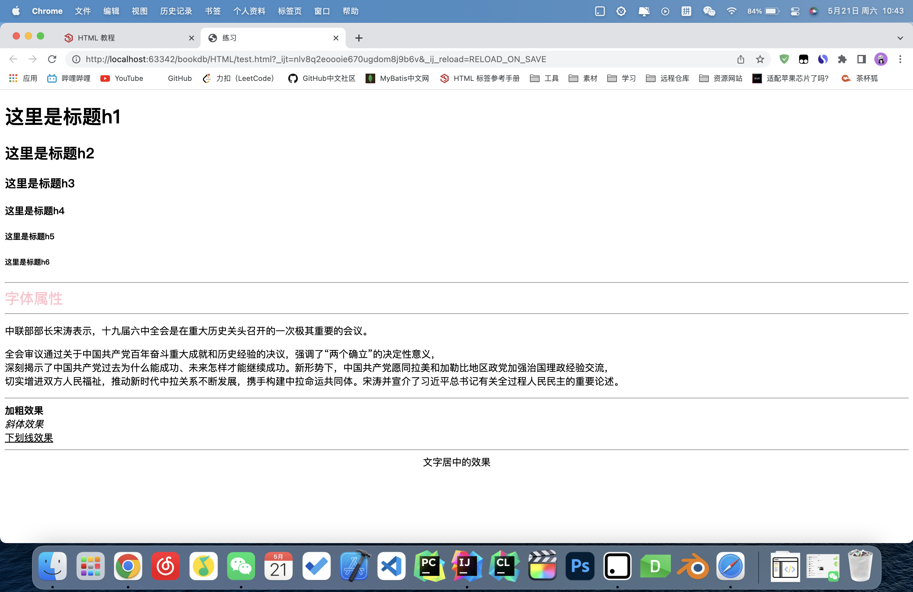
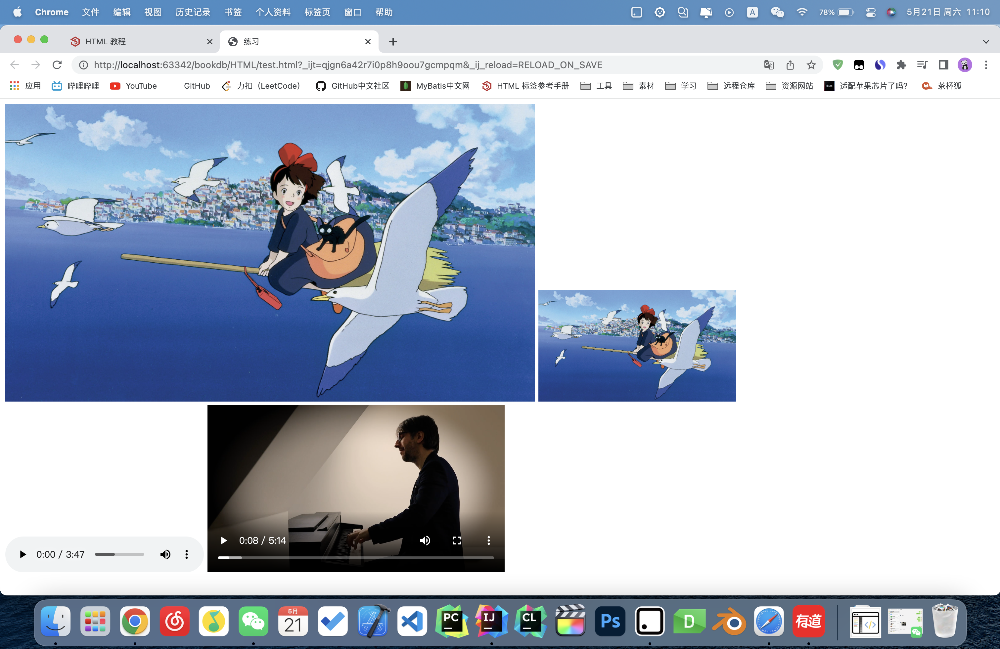
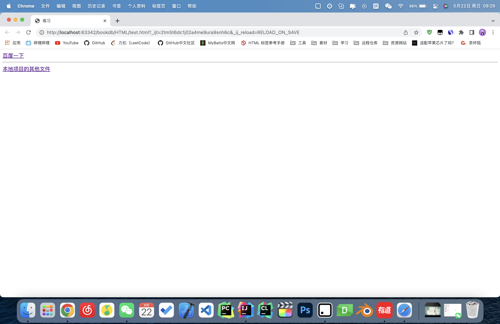
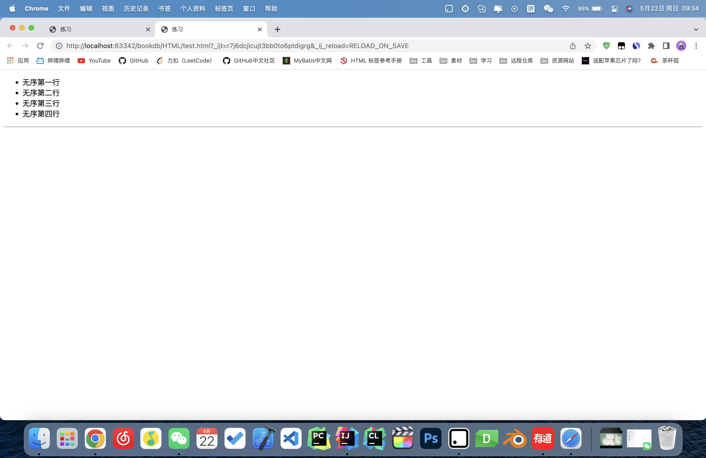
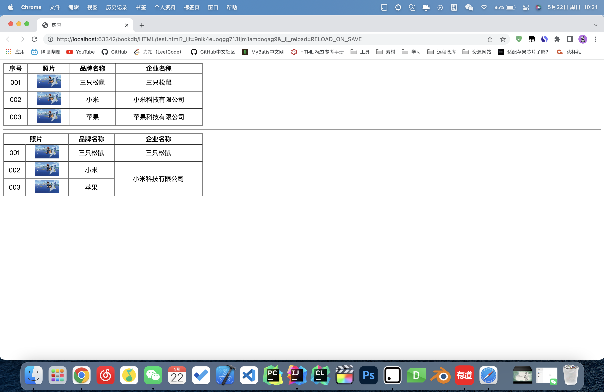
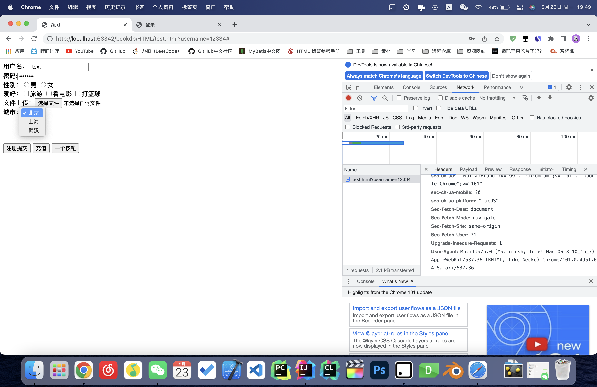

# HTML

## 目录

*   [最基本的结构标签](#最基本的结构标签)

*   [基础标签](#基础标签)

*   [图片音频视频标签](#图片音频视频标签)

*   [超链接标签](#超链接标签)

*   [列表标签](#列表标签)

*   [表格标签](#表格标签)

*   [布局标签](#布局标签)

*   [表单标签](#表单标签)

*   [表单项标签](#表单项标签)

## 最基本的结构标签

```html
<!--HTML5版本的标识-->
<!DOCTYPE html>
<html>
    <head>
        <!--    定义当前页面的字符集-->
        <meta charset="UTF-8">
        <title></title>
    </head>
    <body>
    
    </body>
</html>
```

*   \<html>：网页文件的根标签

*   \<head>：展示资源信息和标题的标签

*   \<title>:指定HTML网页的标题

*   \<body>：浏览器正文的内容标签

## 基础标签

| **标签**      | **描述**         |
| ----------- | -------------- |
| \<h1>-\<h6> | 定义标题，h1最大，h6最小 |
| \<font>     | 定义文本的字体、尺寸、颜色  |
| \<b>        | 定义粗体文本         |
| \<i>        | 定义斜体文本         |
| \<u>        | 定义文本下划线        |
| \<center>   | 定义文本居中         |
| \<p>        | 定义段落           |
| \<br>       | 定义换行           |
| \<hr>       | 定义水平线（分割线）     |



```html
<!DOCTYPE html>
<html lang="en">
<head>
    <meta charset="UTF-8">
    <title>练习</title>
</head>
<body>

<!--标题标签-->
<h1>这里是标题h1</h1>
<h2>这里是标题h2</h2>
<h3>这里是标题h3</h3>
<h4>这里是标题h4</h4>
<h5>这里是标题h5</h5>
<h6>这里是标题h6</h6>

<!--水平分隔符-->
<hr>

<!--字体属性-->
<font face="楷体" size="5" color="#ffc0cb">字体属性</font>
<hr>

<!--段落标签，换行标签-->
<p>
  <!--  第一段文字-->
  中联部部长宋涛表示，十九届六中全会是在重大历史关头召开的一次极其重要的会议。<br>
</p>
<p>
  <!--  第二段文字-->
  全会审议通过关于中国共产党百年奋斗重大成就和历史经验的决议，强调了“两个确立”的决定性意义，<br>
  深刻揭示了中国共产党过去为什么能成功、未来怎样才能继续成功。新形势下，中国共产党愿同拉美和加勒比地区政党加强治国理政经验交流，<br>
  切实增进双方人民福祉，推动新时代中拉关系不断发展，携手构建中拉命运共同体。宋涛并宣介了习近平总书记有关全过程人民民主的重要论述。
</p>
<hr>

<!--加粗、斜体、下划线效果-->
<b>加粗效果</b>
<br>
<i>斜体效果</i>
<br>
<u>下划线效果</u>
<br>
<hr>

<!--文字居中效果-->
<center>
  文字居中的效果
</center>

</body>
</html>

```

## 图片音频视频标签

| **标签**   | **描述** |
| -------- | ------ |
| \   | 定义图片   |
| \<audio> | 定义音频   |
| \<video> | 定义视频   |

***

*   img：定义图片

    *   src：规定显示图像的URL（统一资源定位符）

    *   height：定义图像的高度

    *   width：定义图像的宽度

*   audio：定义音频。支持的格式有MP3、WAV、OGG

    *   src：规定音频的URL

    *   controls：显示播放控件

*   video：定义视频。支持的格式有MP4、WebM、OGG

    *   src：规定视频的URL

    *   controls：显示播放控件

***



```html
<!DOCTYPE html>
<html lang="en">
<head>
    <meta charset="UTF-8">
    <title>练习</title>
</head>
<body>

<!--尺寸单位：-->
<!--        1.px：像素-->
<!--        2.百分比：%-->


<br>

<audio src="../resource/司南%20-%20千秋此意.mp3" controls="controls"></audio>

<video src="../resource/花海.mp4" controls="controls" width="30%"></video>

</body>
</html>
```

## 超链接标签

| 标签   | 描述               |
| ---- | ---------------- |
| \<a> | 定义超链接，用于连接到另一个资源 |



```html
<!DOCTYPE html>
<html lang="en">
<head>
    <meta charset="UTF-8">
    <title>练习</title>
</head>
<body>

<!--链接到其他网页-->
<a href="https://www.baidu.com/">百度一下</a>
<hr>

<!--链接到自己项目中的其他网页文件-->
<a href="login.html">本地项目的其他文件</a>
</body>
</html>
```

*   href：指定访问资源的URL

*   target：指定打开资源的方式

    *   \_self：默认值，在当前页面打开

    *   \_blank：在新页面打开

## 列表标签

| **标签** | 描述     |
| ------ | ------ |
| \<ol>  | 定义有序列表 |
| \<ul>  | 定义无序列表 |
| \<li>  | 定义列表项  |

*   有序列表（order list）


```html
<!DOCTYPE html>
<html lang="en">
<head>
    <meta charset="UTF-8">
    <title>练习</title>
</head>
<body>

<!--有序列表-->
<ol>
    <li>有序第一行</li>
    <li>有序第二行</li>
    <li>有序第三行</li>
    <li>有序第四行</li>
</ol>
<hr>

</body>
</html>

```

*   无序列表（unorder list）



```html
<!DOCTYPE html>
<html lang="en">
<head>
    <meta charset="UTF-8">
    <title>练习</title>
</head>
<body>

<ul>
    <li>无序第一行</li>
    <li>无序第二行</li>
    <li>无序第三行</li>
    <li>无序第四行</li>

</ul>
<hr>

</body>
</html>

```

## 表格标签

| **标签**   | **描述** |
| -------- | ------ |
| \<table> | 定义表格   |
| \<tr>    | 定义行    |
| \<td>    | 定义单元格  |
| \<th>    | 定义头单元格 |

*   table：定义表格

    *   border：规定表格边框的宽度

    *   width：规定表格的宽度

    *   cellspacling：规定单元格之间的空白

*   tr：定义行

    *   align：定义表格行的内容对齐方式

*   td：定义单元格

    *   rowspan：规定单元格可横跨的行数

    *   colspan：规定单元格可横跨的列数



```html
<!DOCTYPE html>
<html lang="en">
<head>
    <meta charset="UTF-8">
    <title>练习</title>
</head>
<body>

<table border="1" cellspacing="0" width="500">
    <tr >
        <th>序号</th>
        <th>照片</th>
        <th>品牌名称</th>
        <th>企业名称</th>
    </tr>
    <tr align="center">
        <td>001</td>
        <td></td>
        <td>三只松鼠</td>
        <td>三只松鼠</td>
    </tr>
    <tr align="center">
        <td>002</td>
        <td></td>
        <td>小米</td>
        <td>小米科技有限公司</td>
    </tr>
    <tr align="center">
        <td>003</td>
        <td></td>
        <td>苹果</td>
        <td>苹果科技有限公司</td>
    </tr>
</table>
<hr>


<table border="1" cellspacing="0" width="500">
    <tr >
<!--        colspan 合并列单元格-->
        <th colspan="2">照片</th>
        <th>品牌名称</th>
        <th>企业名称</th>
    </tr>
    <tr align="center">
        <td>001</td>
        <td></td>
        <td>三只松鼠</td>
        <td>三只松鼠</td>
    </tr>
    <tr align="center">
        <td>002</td>
        <td></td>
        <td>小米</td>
<!--        rowspan 合并行单元格-->
        <td rowspan="2">小米科技有限公司</td>
    </tr>
    <tr align="center">
        <td>003</td>
        <td></td>
        <td>苹果</td>
    </tr>
</table>

</body>
</html>

```

## 布局标签

结合css一起来使用，完成一个页面的布局

| 标签      | 描述                                 |
| ------- | ---------------------------------- |
| \<div>  | 定义HTML文档中的一个区域范围，经常与CSS一起使用，用来布局网页 |
| \<span> | 用于组合行内标签                           |

*   div属于块级标签，即被div包裹的内容占满了一整行。即，接下来写的内容会换行

*   span属于行内标签，不会占满一整行，只会占满包裹到的区域。即，不会换行

## 表单标签

*   表单：在网页中主要负责数据采集功能，使用\<from>标签定义表单

*   表单项（元素）：不同类型的input元素、下拉列表、文本域等

| 标签          | 描述                   |
| ----------- | -------------------- |
| \<from>     | 定义表单                 |
| \<input>    | 定义表单项，通过type属性控制输入形式 |
| \<label>    | 为表单项定义标注             |
| \<select>   | 定义下拉列表               |
| \<option>   | 定义下拉列表的列表项           |
| \<textarea> | 定义文本域                |

```html
<!DOCTYPE html>
<html lang="en">
<head>
    <meta charset="UTF-8">
    <title>练习</title>
</head>
<body>


<form action="#" method="post">
    <input type="text" name="username" id="username">
    <input type="submit">
    
</form>

</body>
</html>
```

*   form：定义表单

    *   action：规定当提交表单时，向何处发送表单数据，URL

    *   method：规定用于发送表单数据的方式

        *   get：默认值，浏览器会将数据直接附着在表单的action URL之后。大小有限制

        *   post：浏览器会将数据放到http请求消息体中。大小无限制

## 表单项标签

*   \<input>:单选项，通过type属性控制输入形式

*   \<select>：定义下拉列表，\<option>定义列表项

*   \<textarea>：文本域

| **type取值** | 描述                      |
| ---------- | ----------------------- |
| text       | 默认值，定义单行的输入字段           |
| password   | 定义密码字段（密文）              |
| radio      | 定义单选按钮                  |
| checkbox   | 定义复选框                   |
| file       | 定义文件上传按钮                |
| hidden     | 定义隐藏的输入字段               |
| submit     | 定义提交按钮，提交按钮会把表单数据发送给服务器 |
| reset      | 定义重置按钮，重置按钮会清除表单中的所有数据  |
| button     | 定义可点击按钮                 |



```html
<!DOCTYPE html>
<html lang="en">
<head>
    <meta charset="UTF-8">
    <title>练习</title>
</head>
<body>


<form action="#" method="post">

<!--    通过<label>中的for=""定位，实现在点击该标签内容时，自动将焦点锁定到id同名的内容-->
<!--    此处测试的内容是：当点击 "用户名"文本时，焦点自动锁定到下一行的单行文本框中-->
    <label for="username">用户名：</label>
    <input type="text" value="text" name="username" id="username"><br>


    密码:<input type="password" value="password" name="password"><br>

    
<!--    多个单选按钮出现时，若要实现仅能选择一个的效果（互斥效果），这将这些单选按钮的 name 值设置为相同的字段-->
<!--    此处测试，两个单选按钮的 name 值，均为：gender-->
<!--    此处的 value 属性设置，表示在提交数据时，提交的内容-->

    性别：<input type="radio" name="gender" value="男">男
    <input type="radio" name="gender" value="女">女<br>

    爱好：<input type="checkbox" name="hobby" value="center1">旅游
    <input type="checkbox" name="hobby" value="center2">看电影
    <input type="checkbox" name="hobby" value="center3">打篮球<br>

    文件上传：<input type="file" name="wenjian"><br>

    城市：<select name="city" id="city">
    <option>北京</option>
    <option>上海</option>
    <option>武汉</option>
    </select>
    <br><br><br><br>

    <input type="submit" value="注册提交">
    <input type="reset" value="充值">
    <input type="button" value="一个按钮">

</form>

</body>
</html>

```
