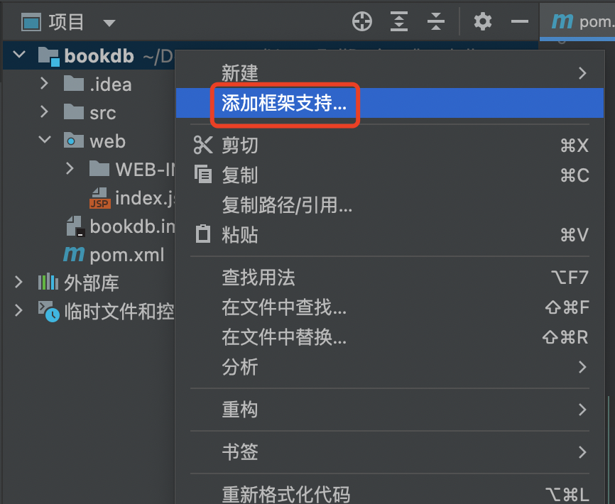

# Maven

## 目录

*   [maven的主要功能](#maven的主要功能)

*   [导入jar包依赖的基本流程](#导入jar包依赖的基本流程)

*   [依赖范围](#依赖范围)

*   [在本地导入maven框架](#在本地导入maven框架)

## maven的主要功能

*   Maven是转没用来管理和构建Java项目的工具，它的主要功能有：

    *   提供了一套标准化的项目结构

        

        ```java
        // 层级结构
        -项目 ————————————————项目名称

            -src ——————————————代码目录
                -main————————————源代码
                    -java————————————源代码java文件目录
                    -resources——————-源代码配置文件目录
                    -webapp——————————Web项目核心陌路
              
                -test————————————测试代码
                    -java————————————测试代码java文件目录
                    -resources———————测试代码配置文件目录
            
            -pom.xml———————————项目核心配置文件

        ```

    *   提供了一套标准化的构建流程（编译、测试、打包、发布等）

        标准的构建流程：编译—>测试—>打包—>发布

        Maven提供一套简单的命令来完成项目构建

    *   提供了一套依赖管理机制

        依赖管理就是管理项目所依赖的第三方资源（jar包、插件等）

        Maven使用简单的坐标配置来管理各种依赖

        只需要简单的配置就可以完成依赖管理

## 导入jar包依赖的基本流程

对pom.xml文件进行修改配置

```java
<!--    默认创建好的pom.xml文件的初始内容-->


<?xml version="1.0" encoding="UTF-8"?>
<project xmlns="http://maven.apache.org/POM/4.0.0"
         xmlns:xsi="http://www.w3.org/2001/XMLSchema-instance"
         xsi:schemaLocation="http://maven.apache.org/POM/4.0.0 http://maven.apache.org/xsd/maven-4.0.0.xsd">
    <modelVersion>4.0.0</modelVersion>


    <!--    当前项目的坐标-->
    <groupId>org.example</groupId>
    <artifactId>maven_demo</artifactId>
    <version>1.0-SNAPSHOT</version>

    <properties>
        <maven.compiler.source>17</maven.compiler.source>
        <maven.compiler.target>17</maven.compiler.target>
    </properties>

</project>

```

*   导入jar包的具体操作

    在\<properties>标签后方插入一个\<dependencies>标签

    在该标签内进行各个包的导入，

    每个需要导入的包都单独放在\<dependency>标签内

    ```java
    -->导入jar包-->

        <dependencies>
            <!-- https://mvnrepository.com/artifact/mysql/mysql-connector-java -->
            <dependency>
                <groupId>*****</groupId>
                <artifactId>*****</artifactId>
                <version>*****</version>
            </dependency>
        </dependencies>

    ```

    ```java
    <!--    以下为演示导入mysql连接驱动jar包的方法-->

        <dependencies>
            <!-- https://mvnrepository.com/artifact/mysql/mysql-connector-java -->
            <dependency>
                <groupId>mysql</groupId>
                <artifactId>mysql-connector-java</artifactId>
                <version>8.0.21</version>
            </dependency>
        </dependencies>
    ```

*   承接上一步具体操作，细节补充

    当需要确定需要导入的jar包的具体填写规范时，

    可以直接使用bing搜索：“\*\*\*\*（导入包的名称）  maven”

    

    选择一个使用频率较高的版本

    

    点击，将框选部分的代码，复制到项目当中的\<dependencies>内，刷新maven即可导入该jar包

    

***

*   快捷导入jar包的操作步骤！！！

    进入到pom.xml文件当中

    使用快捷键："command+N"，选择"依赖项"

    

    在弹出的界面内，输入需要导入的jar包，选择版本

    

## 依赖范围

*   通过设置坐标的范围（scope），可以设置对于的jar包的作用范围：编译环境、测试环境、运行环境

*   下面关键注释的代码，表达的意思是：这个jar包只能在test目录下的jave代码中，运行

*   &#x20;\<scope> test \</scope>

```java
        <dependency>
            <groupId>mysql</groupId>
            <artifactId>mysql-connector-java</artifactId>
            <version>8.0.21</version>
            
<!--   使用<scope>标签，设置jar包的作用域-->
            <scope>test</scope>
            
        </dependency>
```

| 依赖范围     | 编译 | 测试 | 运行 | 例子          |
| -------- | -- | -- | -- | ----------- |
| compile  | Y  | Y  | Y  | logback     |
| test     | -  | Y  | -  | Junit       |
| provided | Y  | Y  | -  | servlet-api |
| runtime  | -  | Y  | Y  | jdbc驱动      |
| system   | Y  | Y  | -  | 存储在本地的jar包  |
| import   |    |    |    |             |

## 在本地导入maven框架

*   打开本地项目，右键项目名，添加框架支持

    

*   下滑，勾选maven，随后确定，完成导入

    
