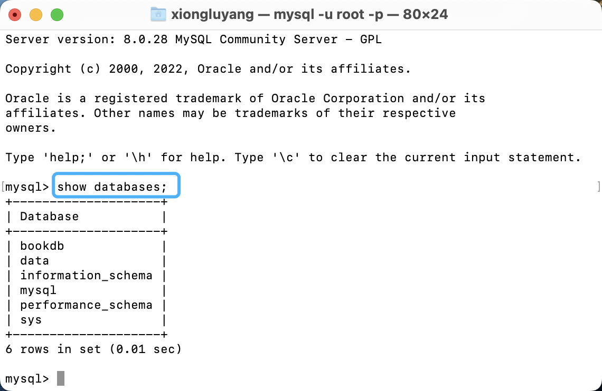
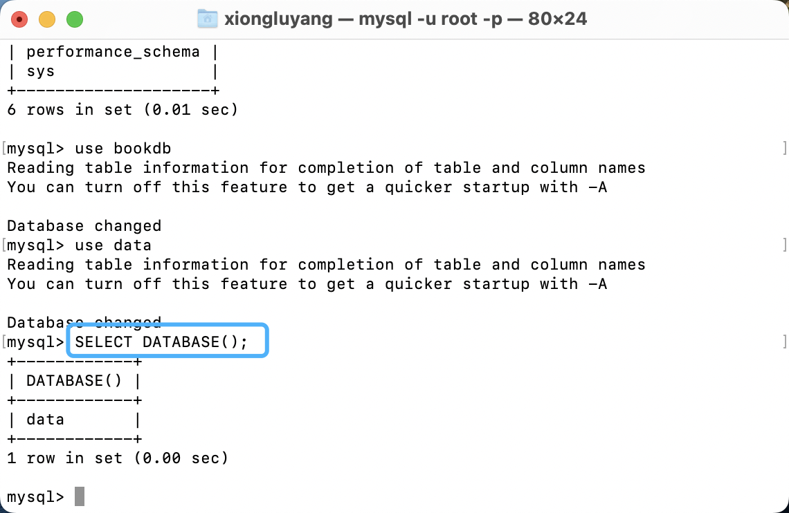
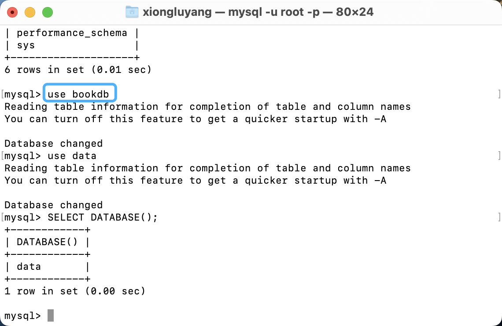

# MySQL数据库

## 目录

*   [数据模型](#数据模型)

*   [MySQL客户端的连接](#mysql客户端的连接)

*   [SQL简单介绍](#sql简单介绍)

    *   [SQL通用语法](#sql通用语法)

*   [SQL语句的分类](#sql语句的分类)

*   [DDL\[数据定义语言\]](#ddl数据定义语言)

    *   [DDL-数据库操作](#ddl-数据库操作)

    *   [DDL-表查询](#ddl-表查询)

    *   [DDL-表创建](#ddl-表创建)

    *   [DDL-表修改](#ddl-表修改)

    *   [DDL-表删除](#ddl-表删除)

*   [DML\[数据操作语言\]](#dml数据操作语言)

    *   [DML-添加数据](#dml-添加数据)

    *   [DML-修改数据](#dml-修改数据)

    *   [DML-删除数据](#dml-删除数据)

*   [DQL\[数据查询语句\]](#dql数据查询语句)

    *   [DQL-基本查询](#dql-基本查询)

    *   [DQL-条件查询](#dql-条件查询)

    *   [DQL-聚合函数](#dql-聚合函数)

    *   [DQL-分组查询](#dql-分组查询)

    *   [DQL-排序查询](#dql-排序查询)

*   [DCL\[数据控制语言\]](#dcl数据控制语言)

    *   [DCL-用户管理](#dcl-用户管理)

    *   [DCL-权限管理](#dcl-权限管理)

*   [函数](#函数)

    *   [字符串函数](#字符串函数)

    *   [数值函数](#数值函数)

    *   [日期函数](#日期函数)

    *   [流程函数](#流程函数)

*   [MySQL数据类型](#mysql数据类型)

    *   [数值类型](#数值类型)

    *   [字符串类型](#字符串类型)

    *   [日期时间类型](#日期时间类型)

## 数据模型

*   关系型数据库（RDBMS）

    *   概念：建立在关系模型基础上，由多张相互连接的二维表组成的数据库。

## MySQL客户端的连接

```text
/usr/local/mysql/bin/mysql -u root -p
<输入数据库连接密码>
```

## SQL简单介绍

### SQL通用语法

1.  SQL语句可以上单行或多行，以分号结尾

2.  SQL语句可以使用空格/缩进来增强语句的可读性

3.  MySQL数据库中的SQL语句不区分大小写，但是关键字建议使用大写

4.  注释的书写格式

    *   单行注释

        *   \- - 注释内容

        *   \# 注释内容（MySQL特有）

    *   多行注释

        *   /\* 注释内容\*/

## SQL语句的分类

| 分类  | 全称                         | 说明                          |
| --- | -------------------------- | --------------------------- |
| DDL | Data Definition Language   | 数据定义语言，用来定义数据库对象（数据库、表、字段）  |
| DML | Data Manipulation Language | 数据操作语言，用来对数据库中的数据进行增删改      |
| DQL | Data Query Language        | 数据查询语言，用来查询数据库中表的记录         |
| DCL | Data Control Language      | 数据控制语言，用来创建数据库用户、控制数据库的访问权限 |

***

## DDL\[数据定义语言]

数据定义语言，用来定义数据库对象（数据库、表、字段）

### DDL-数据库操作

*   查询

    *   查询所有数据库

        

        ```sql
        SHOW DATABASES;
        ```

    *   查看当前数据库

        

        ```sql
        SELECT DATABASE();
        ```

*   创建

    *   字符集建议设置为：utf8mb4

    ```sql
    CREATE DATABASE[IF NOT EXISTS] 数据库名 [DEFAULT CHARSET 字符集] [COLLATE 排序规则]
    ```

*   删除

    ```sql
    DROP DATABASE[IF EXISTS] 数据库名;

    ```

*   使用

    

    ```sql
    USE 数据库名;
    ```

### DDL-表查询

*   查询当前数据库所有表

    ```sql
    SHOW TABLES；
    ```

*   查询表结构

    ```sql
    DESC 表名;
    ```

*   查询指定表的建表语句

    ```sql
    SHOW CREATE TABLE 表名;
    ```

### DDL-表创建

*   创建表

    ```sql
    CREATE TABLE 表名(
        字段1 字段1类型[COMMENT 字段1注解],
        字段2 字段2类型[COMMENT 字段2注解],
        字段3 字段3类型[COMMENT 字段3注解],
        ...
        字段n 字段n类型[COMMENT 字段n注解]
        # 添加的最后一个字段，没有逗号
    )[COMMENT 表注解]；
    ```

### DDL-表修改

*   添加字段

    ```sql
      ALTER TABLE 表名 ADD 字段名 类型(长度)[COMMENT 注解] [约束];
    ```

    *   案例：

        为emp表添加一个新的字段，字段名为nickname，类型为varchar（20）

        ```sql
         ALTER TABLE emp ADD nickname varchar(20) COMMENT "备注信息：昵称";
        ```

*   修改数据类型

    ```sql
    ALTER TABLE 表名 MODIFY 字段名 新数据类型(长度);
    ```

*   修改字段名和字段类型

    ```sql
    ALTER TABLE 表名 CHANGE 旧字段名 新字段名 类型(长度) [COMMENT 注释] [约束];
    ```

*   修改表名

    ```sql
    ALTER TABLE 表名 RENAME TO 新表名;
    ```

    *   案例：

        将emp表的表名修改为employee

        ```sql
        ALTER TABLE emp RENAME TO employee;
        ```

### DDL-表删除

*   删除表

    ```sql
     DROP TABLE[IF EXISTS] 表名;
     # 如果存在这张表，则执行删除，如果不存在，也不报错。
     # 未使用[IF EXISTS]关键字时，仅为执行删除表的操作。若表不存在则会报错
    ```

*   删除指定表，并重新创建该表

    ```sql
     TRUNCATE TABLE 表名;
     # 执行语句之后，会删除表，再重新创建
     # 表中的数据会直接抹除
     # 只保留表结构，清空数据
    ```

## DML\[数据操作语言]

### DML-添加数据

*   给指定字段添加数据

    ```sql
    INSERT INTO 表名(字段名1,字段名2,...) VALUES(值1,值2,...);
    ```

*   给全部字段添加数据

    ```sql
    INSERT INTO 表名 VALUES(值1,值2,...);
    ```

*   批量添加数据

    ```sql
    INSERT INTO 表名(字段名1,字段名2,...) VALUES(值1,值2,...),(值1,值2,...),(值1,值2,...)...;
    INSERT INTO 表名 VALUES(值1,值2,...),(值1,值2,...),(值1,值2,...)...;

    ```

*   注意⚠️：

    1.  插入数据时，指定的字段顺序需要与值的顺序一一对应。

    2.  字符串和日期型数据应该包含在引号里

    3.  插入的数据大小，应该在字段的规定范围内

### DML-修改数据

*   修改数据

    ```sql
    UPDATE 表名 SET 字段名1=值1,字段名2=值2,,... [WHERE 条件];
    # 如果不带 WHERE 条件，则代表着更新整张表的数据
    ```

### DML-删除数据

*   删除数据

    ```sql
    DELETE FROM 表名 [WHERE 条件];
    ```

    *   案例：

        1.  删除 data表中，gender为“女”的数据

            ```sql
            DELETE FROM data WHERE gender='女';
            ```

        2.  删除 data 表中，所有数据

            ```sql
             DELETE FROM data;
            ```

## DQL\[数据查询语句]

*   基本查询

*   条件查询(WHERE)

*   聚合查询(count,max,min,avg,sum)

*   分组查询(GROUP BY)

*   排序查询(ORDER BY)

*   分页查询(LIMIT)

```sql
SELECT
    字段列表
FROM
    表名列表
WHERE
    条件列表
GROUP BY
    分组字段列表
HAVING
    分组后条件列表
ORDER BY
    排序字段列表
LIMIT
    分页参数

```

### DQL-基本查询

在实际开发当中，尽量避免使用 “\*” 作为查询内容。影响效率；无法直观的了解到查询的信息内容，与他人对接任务时会造成不必要的困扰。

*   查询多个字段

    ```sql
     SELECT 字段1,字段2,字段3,... FROM 表名;
     SELECT * FROM 表名;
    ```

    *   案例：

        1.  查询data\_run 表中，指定字段 name,age,workno 返回

            ```sql
            SELECT name,age,workno FROM data_run;
            ```

        2.  查询data表中所有字段 返回

            ```sql
             SELECT * FROM data_run;
            ```

*   起别名

    ```sql
     SELECT 字段名 [as 别名] FROM 表名;
    ```

    *   案例：

        *   查看data\_run 表中，workaddress字段的信息，起别名 返回

            ```sql
            SELECT workaddress AS ‘工作地址’ FROM data_run;
            ```

*   去除重复记录

    ```sql
     SELECT DISTINCT 字段列表 FROM 表名;
    ```

    *   案例：

        *   查询data\_run 数据库中 workaddress 的记录（不要重复） 返回

            ```sql
            SELECT DISTINCT workaddress AS '工作地址' FROM data_run;
            ```

### DQL-条件查询

1.  语法

    ```sql
     SELECT 字段列表 FROM 表名 WHERE 条件列表;
    ```

2.  案例

    ```sql
    # 所有操作访问的数据库表名均为：emp（员工信息表）

    -- 1.查询年龄为88的员工信息
    SELECT * FROM emp WHERE age=88;

    -- 2.查询年龄小于20的员工信息
    SELECT * FROM emp WHERE age<20;

    -- 3.查询年龄小于等于20的员工信息
    SELECT * FROM emp WHERE age<=20; # 此处输入的符号为：(< =)

    -- 4.查询没有身份证号信息（值为NULL）的员工信息
    SELECT * FROM emp WHERE idcart IS NULL;

    -- 5.查询有员工身份证号信息（值不为NULL）的点员工信息
    SELECT * FROM emp WHERE idcart IS NOT NULL;

    -- 6.查询年龄不等于88的员工信息
    SELECT * FROM emp WHERE age !=88; # 此处输入的符号为：(! =)

    SELECT * FROM emp WHERE age <>88; # 此处输入的符号为：(< >)

    -- 7.查询年龄在15岁（包含）到20岁（包含）之间的员工信息
    SELECT * FROM emp WHERE age >=15 AND age <=20;
    SELECT * FROM emp WHERE age BETWEEN 15 AND 20; # 使用BETWEEN 值1 AND 值2 时，值1<值2

    -- 8.查询性别为女，且年龄小于25岁的员工信息
    SELECT * FROM emp WHERE sex = '女' AND age <25;

    -- 9.查询年龄等于18或20或40的员工信息
    SELECT * FROM emp WHERE age =18 OR age =20 OR age = 40;
    SELECT * FROM emp WHERE age IN(18,20,40);

    -- 10.查询姓名为两个字的员工信息
    SELECT * FROM emp WHERE name LIKE '__'; # 此处为两个下划线（占位符），表示查询name值有两个占位符的信息，匹配查询

    -- 11.查询身份证号最后一位是X的员工信息
    SELECT * FROM emp WHERE idcard LIKE ‘%x’; # 表示idcard的值，前面多少位无所谓（使用 % 匹配多个字符），仅要求最后一个字符为 x 

    ```

3.  条件

| 比较运算符            | 功能                      |
| ---------------- | ----------------------- |
| >                | 大于                      |
| >=               | 大于等于                    |
| <                | 小于                      |
| <=               | 小于等于                    |
| =                | 等于                      |
| <> 或 !=          | 不等于                     |
| BETWEEN...AND... | 在某个范围内（含最小、最大值）         |
| IN(...)          | 在in之后的列表中的值，多选一         |
| LIKE 占位符         | 模糊匹配（\_匹配单个字符，%匹配任意个字符） |
| IS NULL          | 是NULL                   |

| 逻辑运算符  | 功能             |
| ------ | -------------- |
| AND或&& | 并且（多个条件同时成立）   |
| OR或｜｜  | 或者（多个条件任意一个成立） |
| NOT或！  | 非，不是           |

### DQL-聚合函数

*   聚合函数：将一列数据视为一个整体，进行纵向计算。

*   常见的聚合函数（作用于表当中的某一列数据）

    | 函数    | 功能   |
    | ----- | ---- |
    | count | 统计数量 |
    | max   | 最大值  |
    | min   | 最小值  |
    | avg   | 平均值  |
    | sum   | 求和   |

*   语法

    ```sql
    SELECT 聚合函数(字段列表) FROM 表名;
    ```

### DQL-分组查询

*   语法

    ```sql
    SELECT 字段列表 FROM 表名 [WHERE 条件] GROUP BY 分组字段名 [HAVING 分组后过滤条件];
    ```

### DQL-排序查询

*   语法

    ```sql
    SELECT 字段列表 FROM 表名 ORDER BY 字段1 排序方式1,字段2 排序方式2;
    ```

*   排序方式

    *   ASC：升序（默认值）

    *   DESC：降序

*   注意⚠️：如果是对字段排序时，放第一个字段值相同时，才会根据第二个字段进行排序。

***

```sql
# 所有操作访问的数据库表名均为：emp（员工信息表）

-- 1.根据年龄对员工进行升序排序
SELECT * FROM emp ORDER BY age ASC;

-- 2.根据入职时间，对员工进行降序排序
SELECT * FROM emp ORDER BY entrydate DESC;

-- 3.根据年龄对宇昂进行升序排序，如果年龄相同，再按照入职时间进行降序排序
SELECT * FROM emp ORDER BY age ASC,entrydate DESC;
```

## DCL\[数据控制语言]

DCL英文全称是Data Control Language（数据控制语言），用来管理数据库用户、控制数据库的访问权限。

### DCL-用户管理

1.  查询用户

    ```sql
    USE mysql;
    SELECT * FROM user;
    ```

2.  创建用户

    ```sql
    CREATE USER '用户名'@'主机名' IDENTIFIED BY '密码';
    ```

3.  修改用户密码

    ```sql
    ALTER USER '用户名'@'主机名' IDENTIFIED WITH mysql_native_password BY '新密码';
    ```

4.  删除用户

    ```sql
    DROP USER '用户名'@'主机名';
    ```

5.  模拟实际需求的案例：

    ```sql
    -- 创建用户 itcast，只能够在当前主机localhost访问，密码123456
    CREATE USER 'itcast'@'localhost' IDENTIFIED BY '123456';

    -- 创建用户 heima，可以在任意主机访问该数据库，密码123456
    CREATE USER 'heima'@'%' IDENTIFIED BY '123456';

    -- 修改用户 heima 的访问密码为123321
    ALTER USER 'heima'@'%' IDENTIFIED WITH mysql_native_password BY '123321';

    -- 删除itcast@localhost用户
    DROP USER 'itcast'@'localhost';
    ```

### DCL-权限管理

MySQL中定义了很多种权限，但常见的仅有一下几种：

| 权限                 | 说明         |
| ------------------ | ---------- |
| ALL,ALL PRIVILEGES | 所有权限       |
| SELECT             | 查询数据       |
| INSERT             | 插入数据       |
| UPDATE             | 修改数据       |
| DELETE             | 删除数据       |
| ALTER              | 修改表        |
| DROP               | 删除数据库/表/视图 |
| CREATE             | 创建数据库/表    |

*   查询权限

    ```sql
    SHOW GRANTS FOR '用户名'@'主机名';
    ```

*   授予权限

    ```sql
    GRANT 权限列表 ON 数据库名.表名 TO '用户名'@'主机名';

    # 数据库名.表名也可以设置为： *.* (意为权限针对所有数据库里的所有表)
    ```

*   撤销权限

    ```sql
    REVOKE 权限列表 ON 数据库名.表名 FROM '用户名'@'主机名';

    # 数据库名.表名也可以设置为： *.* (意为权限针对所有数据库里的所有表)

    ```

## 函数

### 字符串函数

MySQL内嵌了很多字符串函数，其中常用的几个如下：

| 函数                       | 功能                               |
| ------------------------ | -------------------------------- |
| CONCAT(s1,s2,,,sn)       | 字符串拼接，将s1,s2,,,sn拼接成一个字符串        |
| LOWER(str)               | 将字符串str全部转换为小写                   |
| UPPER(str)               | 将字符串str全部转换为大写                   |
| LPAD(str,n,pad)          | 左填充，用字符串pad对str的左边进行填充，达到n个字符串长度 |
| RPAD(str,n,pad)          | 右填充，用字符串pad对str的右边进行填充，达到n个字符串长度 |
| TRIM(str)                | 去掉字符串头部和尾部的空格                    |
| SUBSTRING(str,start,len) | 返回从字符串str从start位置起的len个长度的字符串    |

### 数值函数

### 日期函数

### 流程函数

## MySQL数据类型

MySQL中的数据类型主要分为三类：数值类型、字符串类型、日期时间类型

### 数值类型

| 类型          | 大小                              | 范围（有符号）                                                                                                                         | 范围（无符号）                                                         | 用途    |
| ----------- | ------------------------------- | ------------------------------------------------------------------------------------------------------------------------------- | --------------------------------------------------------------- | ----- |
| TINYINT     | 1 Bytes                         | (-128，127)                                                                                                                      | (0，255)                                                         | 小整数值  |
| SMALLINT    | 2 Bytes                         | (-32 768，32 767)                                                                                                                | (0，65 535)                                                      | 大整数值  |
| MEDIUMINT   | 3 Bytes                         | (-8 388 608，8 388 607)                                                                                                          | (0，16 777 215)                                                  | 大整数值  |
| INT或INTEGER | 4 Bytes                         | (-2 147 483 648，2 147 483 647)                                                                                                  | (0，4 294 967 295)                                               | 大整数值  |
| BIGINT      | 8 Bytes                         | (-9,223,372,036,854,775,808，9 223 372 036 854 775 807)                                                                          | (0，18 446 744 073 709 551 615)                                  | 极大整数值 |
| FLOAT       | 4 Bytes                         | (-3.402 823 466 E+38，-1.175 494 351 E-38)，0，(1.175 494 351 E-38，3.402 823 466 351 E+38)                                         | 0，(1.175 494 351 E-38，3.402 823 466 E+38)                       | 单精度   |
| 浮点数值        |                                 |                                                                                                                                 |                                                                 |       |
| DOUBLE      | 8 Bytes                         | (-1.797 693 134 862 315 7 E+308，-2.225 073 858 507 201 4 E-308)，0，(2.225 073 858 507 201 4 E-308，1.797 693 134 862 315 7 E+308) | 0，(2.225 073 858 507 201 4 E-308，1.797 693 134 862 315 7 E+308) | 双精度   |
| 浮点数值        |                                 |                                                                                                                                 |                                                                 |       |
| DECIMAL     | 对DECIMAL(M,D) ，如果M>D，为M+2否则为D+2 | 依赖于M和D的值                                                                                                                        | 依赖于M和D的值                                                        | 小数值   |

### 字符串类型

| 类型         | 大小                    | 用途                 |
| ---------- | --------------------- | ------------------ |
| CHAR       | 0-255 bytes           | 定长字符串              |
| VARCHAR    | 0-65535 bytes         | 变长字符串              |
| TINYBLOB   | 0-255 bytes           | 不超过 255 个字符的二进制字符串 |
| TINYTEXT   | 0-255 bytes           | 短文本字符串             |
| BLOB       | 0-65 535 bytes        | 二进制形式的长文本数据        |
| TEXT       | 0-65 535 bytes        | 长文本数据              |
| MEDIUMBLOB | 0-16 777 215 bytes    | 二进制形式的中等长度文本数据     |
| MEDIUMTEXT | 0-16 777 215 bytes    | 中等长度文本数据           |
| LONGBLOB   | 0-4 294 967 295 bytes | 二进制形式的极大文本数据       |
| LONGTEXT   | 0-4 294 967 295 bytes | 极大文本数据             |

### 日期时间类型

\| 类型        | 大小 &#x20;
( bytes) | 范围                                                                                                                  | 格式                  | 用途           |
\| --------- | ----------------- | ------------------------------------------------------------------------------------------------------------------- | ------------------- | ------------ |
\| DATE      | 3                 | 1000-01-01/9999-12-31                                                                                               | YYYY-MM-DD          | 日期值          |
\| TIME      | 3                 | '-838:59:59'/'838:59:59'                                                                                            | HH:MM:SS            | 时间值或持续时间     |
\| YEAR      | 1                 | 1901/2155                                                                                                           | YYYY                | 年份值          |
\| DATETIME  | 8                 | 1000-01-01 00:00:00/9999-12-31 23:59:59                                                                             | YYYY-MM-DD HH:MM:SS | 混合日期和时间值     |
\| TIMESTAMP | 4                 | 1970-01-01 00:00:00/2038

结束时间是第 **2147483647** 秒，北京时间 **2038-1-19 11:14:07**，格林尼治时间 2038年1月19日 凌晨 03:14:07 | YYYYMMDD HHMMSS     | 混合日期和时间值，时间戳 |
