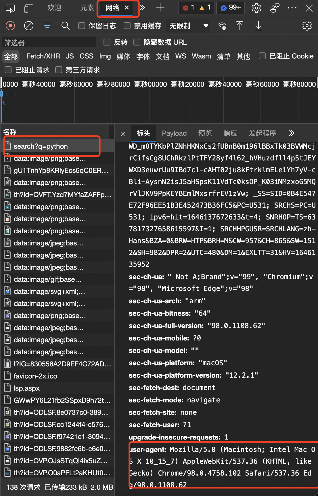
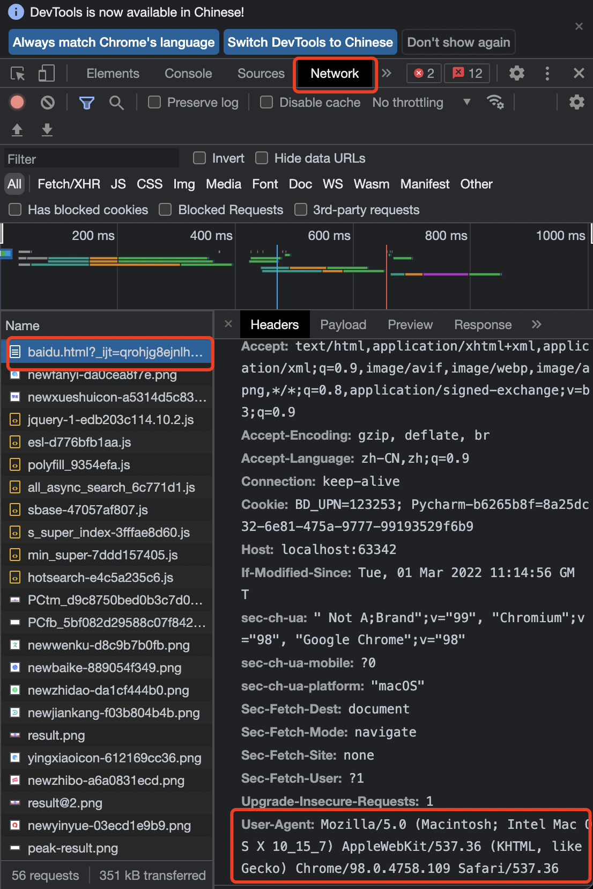

# Python爬虫

## 目录

*   [urllib库使用](#urllib库使用)

*   [urllib.error.URLError: \<urlopen error \[SSL: CERTIFICATE\_VERIFY\_FAILED\] certificate verify failed (\_ssl.c:xxx)>](#urlliberrorurlerror-urlopen-error-ssl-certificate_verify_failed-certificate-verify-failed-_sslcxxx)

*   [一个类型和六种方法](#一个类型和六种方法)

*   [Urllib下载](#urllib下载)

*   [扩展1：url的组成](#扩展1url的组成)

*   [请求对象的定制](#请求对象的定制)

*   [get 请求的quote方法： urllib.parse.quote()](#get-请求的quote方法-urllibparsequote)

*   [get请求的urlencode方法：urllib.parse.urlencode()](#get请求的urlencode方法urllibparseurlencode)

*   [ajax的get请求方法](#ajax的get请求方法)

## urllib库使用

python标准库中自带的库，无需单独安装

urllib.request.urlopen()  模拟浏览器向服务器发送请求

response 服务器返回数据

response的数据类型是HttpResponse

字节—>字符串

解码decode

字符串—>字节

编码encode

read()  字节形式读取二进制    扩展：read(5)返回前几个字节

readline()  读取一行

deadlines() 一行一行读取直至结束

getcode()  获取状态码

geturl()  获取url

getheaders() 获取headers

urllib.request.urlretrieve（）

请求网页

请求图片

请求视频

```python
# 查看网站：“百度以下”的网页源码
# 使用urllib来获取百度首页的源码

# 导入所需用到的库
import urllib.request

# 定义一个url，即将要访问的地址
url = 'http://www.baidu.com'

# 模拟浏览器向服务器发送请求,respones(响应的意思，为自定义元素)
response = urllib.request.urlopen(url)

# 获取响应中的页面源码,content(内容的意思，也为自定义元素)
# read() 返回的是字节形式的二进制数据，需要再转换为字符串
# 二进制字节转换为字符串的过程，称之为解码
# 直接查看网页中的源码，查看源码的转译方式（此处使用的百度的转码方式为‘utf-8’）

# decode('<此处填充需要转码的格式>') 将字节转换为字符串-解码 
content = response.read().decode('utf-8')

# 打印数据内容
print(content)
```

## urllib.error.URLError: \<urlopen error \[SSL: CERTIFICATE\_VERIFY\_FAILED] certificate verify failed (\_ssl.c:xxx)>

当遇到该报错时候，在代码主体钱前加入下列代码：

```python
import ssl
ssl._create_default_https_context = ssl._create_unverified_context
```

## 一个类型和六种方法

一个类型：HTTPRespones

六种方法：read（），readline（），readlines（），getcode（），geturl（），getheaders（）

```python
import urllib.request

url = 'http://www.baidu.com'
response = urllib.request.urlopen(url)

print(type(response))  # response 是HTTPRespones的类型

# read(),read(n)
content_1 = response.read()  # 按照一个字节一个字节去读
content_2 = response.read(10)  # read()中括号内的数字，表示返回多少个字节

# readline(),readlines() 
content_3 = response.readline()  # 按照一行的去读，但仅能读取一行
content_4 = response.readlines()  # 按照一行一行的去读，直到读完

# getcode()
print(response.getcode())  # 返回状态码，若返回值为200，这证明逻辑无误

# geturl()
print(response.geturl())  # 返回的是URL网页地址

# getheaders()
print(response.getheaders()) # 获取网页的状态信息
```

## Urllib下载

下载网页

urllib.request.urlretrieve（）

```python
import urllib.request

# 下载网页
url_page = 'http://www.baidu.com'

# urlretrieve(url,filename) url代表的是下载的路径，filename代表文件的名字
# rulretrieve(url = url_page, filename = 'baidu.html') 使用这种格式输入也没问题，不常用但更规范
urllib.request.urlretrieve(url_page, 'baidu.html') 

```

下载图片

urllib.request.urlretrieve（）

```python
import urllib.request

# 下载图片
url_img = 'https://image.baidu.com/search/detail?ct=503316480&z=undefined&tn=baiduimagedetail&ipn=d&word=lisa&step_word=&ie=utf-8&in=&cl=2&lm=-1&st=undefined&hd=undefined&latest=undefined&copyright=undefined&cs=382570410,1976641915&os=1404863639,4107214669&simid=4259445313,590225598&pn=5&rn=1&di=7042744173476184065&ln=1275&fr=&fmq=1646134085567_R&fm=&ic=undefined&s=undefined&se=&sme=&tab=0&width=undefined&height=undefined&face=undefined&is=0,0&istype=0&ist=&jit=&bdtype=0&spn=0&pi=0&gsm=0&objurl=https%3A%2F%2Fgimg2.baidu.com%2Fimage_search%2Fsrc%3Dhttp%253A%252F%252Fc-ssl.duitang.com%252Fuploads%252Fitem%252F202003%252F27%252F20200327235201_qwxtc.thumb.1000_0.jpg%26refer%3Dhttp%253A%252F%252Fc-ssl.duitang.com%26app%3D2002%26size%3Df9999%2C10000%26q%3Da80%26n%3D0%26g%3D0n%26fmt%3Djpeg%3Fsec%3D1648726086%26t%3Da96e0b4ccde94eb4a26b9b345ffd4637&rpstart=0&rpnum=0&adpicid=0&nojc=undefined&dyTabStr=MCwzLDEsNiw0LDUsNyw4LDIsOQ%3D%3D'
# 在网页中找到图片，‘’中的内容为图片地址

urllib.request.urlretrieve(url_img,'ganyu.jpg')
```

下载视频

urllib.request.urlretrieve（）            与<下载图片>相同。

```python
import urllib.request

# 下载视频
url_video = '链接参数'
# ''中的内容与图片操作方法类似，附加：需要网页<检查>，内容定位
urllib.request.urlretrieve(url参数，filename参数)
```

## 扩展1：url的组成

范例网站地址：[https://cn.bing.com/search?q=python](https://cn.bing.com/search?q=pytho "https://cn.bing.com/search?q=python")

&#x20;                         [https://www.baidu.com/s?ie=utf-8\&wd=pytho](https://www.baidu.com/s?ie=utf-8\&wd=pytho "https://www.baidu.com/s?ie=utf-8\&wd=pytho")n

| 举例\组成部分 | 协议         | 主机                                    | 端口号    | 路径     | 参数        | 锚点(一般用在百度检索上) |
| ------- | ---------- | ------------------------------------- | ------ | ------ | --------- | ------------- |
|         | http\https | cn.bing.com                           | 80\443 | search | q=python  |               |
|         | http\https | [www.baidu.com](http://www.baidu.com) | 80\443 | s      | wb=python | #             |
|         |            |                                       |        |        |           |               |

## 请求对象的定制

UA介绍：User Agent中文名为用户代理，简称UA，是一个特殊字符串头，使服务器能够识别客户使用的操作系统版本、CPU类型、浏览器及版本、浏览器内核、浏览器渲染引擎等。

请求对象的定制是解决反爬的第一种手段。

Edge浏览器查看UA的方法

1.  任意网页下右键打开网页<检查>

2.  选择<网络>进入，随后刷新页面获取内容

3.  选择左侧<名称>中第一个内容

4.  在<标头>内，下滑至最底部，最后一个参数即为UA参数



Chrome浏览器查看UA的方法

1.  任意网页下右键打开网页<检查>

2.  选择进入\<Network>，随后刷新也页面

3.  选择右侧\<Name>中的第一个内容

4.  在\<Headers>内，下滑至最底部，最后一个参数即为UA参数



```python
import urllib.request
import ssl
ssl._create_default_https_context = ssl._create_unverified_context
# https://www.baidu.com/s?wd=lisa&rsv_spt=1&rsv_iqid=0x94b7d1ba0003f6ae&issp=1&f=8&rsv_bp=1&rsv_idx=2&ie=utf-8&tn=baiduhome_pg&rsv_dl=tb&rsv_enter=1&rsv_sug3=5&rsv_sug1=1&rsv_sug7=100&rsv_sug2=0&rsv_btype=i&prefixsug=lisa&rsp=5&inputT=1935&rsv_sug4=2560

url = 'https://www.baidu.com/s?wd=lisa&rsv_spt=1&rsv_iqid=0x94b7d1ba0003f6ae&issp=1&f=8&rsv_bp=1&rsv_idx=2&ie=utf-8' \
      '&tn=baiduhome_pg&rsv_dl=tb&rsv_enter=1&rsv_sug3=5&rsv_sug1=1&rsv_sug7=100&rsv_sug2=0&rsv_btype=i&prefixsug' \
      '=lisa&rsp=5&inputT=1935&rsv_sug4=2560 '

# 请求对象定制，通过检查自己电脑浏览器的各项参数，来更好的模拟访问服务器的缓解
headers = {
    'User-Agent':  'Mozilla/5.0 (Macintosh; Intel Mac OS X 10_15_7) AppleWebKit/537.36 (KHTML, like Gecko) Chrome/98.0.4758.102 Safari/537.36 Edg/98.0.1108.62 '
}
request = urllib.request.Request(url=url, headers=headers)

# 模拟浏览器向服务器发送请求
response = urllib.request.urlopen(request)

# 获取响应内容
content = response.read().decode('utf8')

# 打印数据
print(content)
```

## get 请求的quote方法： urllib.parse.quote()

实现将能被人类所认识的字符串格式转换为unicode格式，并与网页地址的前半部分拼接，形成新的完整的网页，直接进行网页的浏览、访问、查询。

url（完整的版本） = url（固定网址的前半部分） + name（人类能够认识的字符串格式文本）

<[https://www.baidu.com/s?wd=](https://www.baidu.com/s?wd=lisa\&rsv_spt=1\&rsv_iqid=0x94b7d1ba0003f6ae\&issp=1\&f=8\&rsv_bp=1\&rsv_idx=2\&ie=utf-8\&tn=baiduhome_pg\&rsv_dl=tb\&rsv_enter=1\&rsv_sug3=5\&rsv_sug1=1\&rsv_sug7=100\&rsv_sug2=0\&rsv_btype=i\&prefixsug=lisa\&rsp=5\&inputT=1935\&rsv_sug4=2560 "https://www.baidu.com/s?wd=")[>   +<](https://www.baidu.com/s?wd=lisa\&rsv_spt=1\&rsv_iqid=0x94b7d1ba0003f6ae\&issp=1\&f=8\&rsv_bp=1\&rsv_idx=2\&ie=utf-8\&tn=baiduhome_pg\&rsv_dl=tb\&rsv_enter=1\&rsv_sug3=5\&rsv_sug1=1\&rsv_sug7=100\&rsv_sug2=0\&rsv_btype=i\&prefixsug=lisa\&rsp=5\&inputT=1935\&rsv_sug4=2560 ">   +<")[lisa\&rsv\_spt=1\&rsv\_iqid=0x94b7d1ba0003f6ae\&issp=1\&f=8\&rsv\_bp=1\&rsv\_idx=2\&ie=utf-8\&tn=baiduhome\_pg\&rsv\_dl=tb\&rsv\_enter=1\&rsv\_sug3=5\&rsv\_sug1=1\&rsv\_sug7=100\&rsv\_sug2=0\&rsv\_btype=i\&prefixsug=lisa\&rsp=5\&inputT=1935\&rsv\_sug4=2560](https://www.baidu.com/s?wd=lisa\&rsv_spt=1\&rsv_iqid=0x94b7d1ba0003f6ae\&issp=1\&f=8\&rsv_bp=1\&rsv_idx=2\&ie=utf-8\&tn=baiduhome_pg\&rsv_dl=tb\&rsv_enter=1\&rsv_sug3=5\&rsv_sug1=1\&rsv_sug7=100\&rsv_sug2=0\&rsv_btype=i\&prefixsug=lisa\&rsp=5\&inputT=1935\&rsv_sug4=2560 "lisa\&rsv_spt=1\&rsv_iqid=0x94b7d1ba0003f6ae\&issp=1\&f=8\&rsv_bp=1\&rsv_idx=2\&ie=utf-8\&tn=baiduhome_pg\&rsv_dl=tb\&rsv_enter=1\&rsv_sug3=5\&rsv_sug1=1\&rsv_sug7=100\&rsv_sug2=0\&rsv_btype=i\&prefixsug=lisa\&rsp=5\&inputT=1935\&rsv_sug4=2560")>

```python
import urllib.parse

url = 'https://www.baidu.com/s?'
# 将<任意内容>变为unicode编码的形式
# 依赖于urllib.parse
name = urllib.parse.quote('<任意内容>')

# 将它与网页的前半部分和后半部分进行拼接，
# 组成想要请求的网站。
url = url + new_data

```

与上面的代码结合

```python
import urllib.request
import urllib.parse
import ssl
ssl._create_default_https_context = ssl._create_unverified_context
# https://www.baidu.com/s?wd=lisa&rsv_spt=1&rsv_iqid=0x94b7d1ba0003f6ae&issp=1&f=8&rsv_bp=1&rsv_idx=2&ie=utf-8&tn=baiduhome_pg&rsv_dl=tb&rsv_enter=1&rsv_sug3=5&rsv_sug1=1&rsv_sug7=100&rsv_sug2=0&rsv_btype=i&prefixsug=lisa&rsp=5&inputT=1935&rsv_sug4=2560

url = 'https://www.baidu.com/s?wd='

# 请求对象定制，通过检查自己电脑浏览器的各项参数，来更好的模拟访问服务器的缓解
headers = {
    'User-Agent':  'Mozilla/5.0 (Macintosh; Intel Mac OS X 10_15_7) AppleWebKit/537.36 (KHTML, like Gecko) Chrome/98.0.4758.102 Safari/537.36 Edg/98.0.1108.62 '
}

name = urllib.parse.quote('<任意内容>')
url = url + name

request = urllib.request.Request(url=url, headers=headers)

# 模拟浏览器向服务器发送请求
response = urllib.request.urlopen(request)

# 获取响应内容
content = response.read().decode('utf8')

# 打印数据
print(content)
```

```python
def github():
    if __name__ == '__main__':
        ssl._create_default_https_context = ssl._create_unverified_context

        url = 'https://github.com/search?q='

        headers = {
            'User-Agent': 'Mozilla/5.0 (Macintosh; Intel Mac OS X 10_15_7) AppleWebKit/537.36 (KHTML, like Gecko) Chrome/98.0.4758.102 Safari/537.36 Edg/98.0.1108.62 '
        }

        name = urllib.parse.quote('%s' % res)
        url = url + name

        request = urllib.request.Request(url=url, headers=headers)

        # 模拟浏览器向服务器发送请求
        response = urllib.request.urlopen(request)

        # 获取响应内容
        content = response.read().decode('utf-8')

        # 打印数据
        print(content)
```

## get请求的urlencode方法：urllib.parse.urlencode()

应用场景：在有多个参数出现的时候

```python
url = 'https://www.baidu.com/s?'
data = {
    'wd': '周杰伦',
    'sex': '男'
}
new_data = urllib.parse.urlencode(data)

url = url + new_data
```

与上面的代码结合

```python
import urllib.request
import urllib.parse
import ssl
ssl._create_default_https_context = ssl._create_unverified_context
# https://www.baidu.com/s?wd=lisa&rsv_spt=1&rsv_iqid=0x94b7d1ba0003f6ae&issp=1&f=8&rsv_bp=1&rsv_idx=2&ie=utf-8&tn=baiduhome_pg&rsv_dl=tb&rsv_enter=1&rsv_sug3=5&rsv_sug1=1&rsv_sug7=100&rsv_sug2=0&rsv_btype=i&prefixsug=lisa&rsp=5&inputT=1935&rsv_sug4=2560


# 定制请求对象
headers = {
    'User-Agent':  'Mozilla/5.0 (Macintosh; Intel Mac OS X 10_15_7) AppleWebKit/537.36 (KHTML, like Gecko) Chrome/98.0.4758.102 Safari/537.36 Edg/98.0.1108.62 '
}

url = 'https://www.baidu.com/s?'
data = {
    'wd': '周杰伦',
    'sex': '男'
}
new_data = urllib.parse.urlencode(data)

url = url + new_data


requset = urllib.request.Request(url=url, headers=headers)
respones = urllib.request.urlopen(requset)

content = respones.read().decode('utf-8')

print(content)
```

## ajax的get请求方法
